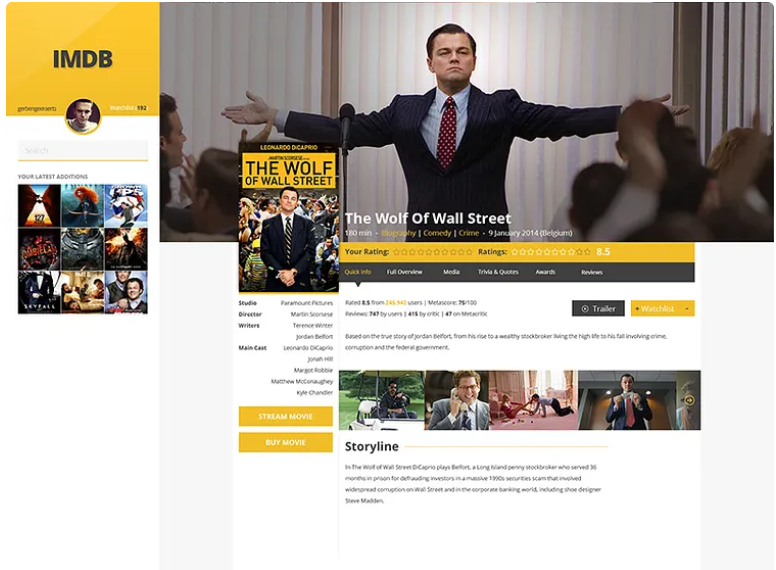

**Independent Section 1 - Project: EDA with Pandas**

**IMDB Film Data Analysis**

**OVERVIEW**  
The global film industry continues to generate massive volumes of content annually, making data-driven insights critical for production, distribution, and audience targeting. This dataset, derived from IMDb's title.basics file, provides key attributes of movies, including genres, runtime, and release year. By analyzing these attributes, we aim to uncover trends in movie characteristics over time, identify dominant genres, and evaluate shifts in viewer preferences. This foundational knowledge is essential for decision-making in areas such as content creation, marketing strategies, and investment focus within the entertainment industry.

**PROBLEM STATEMENT**  

Like other industries, the film industry faces its own set of challenges. It has emerged as a groundbreaking sector that is used to express feelings, inform, educate, and entertain. Film production companies, streaming platforms, and content marketers often struggle with decisions regarding:

- What types of movies to invest in
- The typical runtime of a movie
- Which genres are gaining or losing popularity
- The best genre combinations for each year

This project seeks to answer the following question:  
**“What are the most popular movie genres over time, how do runtime patterns vary across genres, and how can this information help stakeholders align production with audience demand?”**

Solving this problem will enable film-related businesses to better allocate their budgets, predict content success, and design catalogs that cater to viewer preferences by year and genre.
